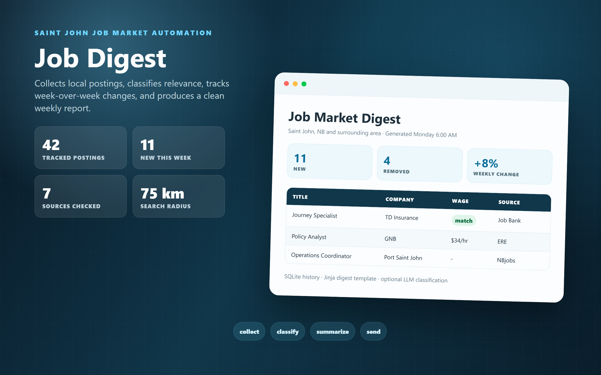

# Job Digest

Saint John job posting digest automation for practical, hands-on work in a 75 km search radius.

The project collects configured job sources, classifies relevant postings, keeps week-over-week history in SQLite, and generates a clean weekly digest. Email delivery is optional and uses Gmail SMTP when local credentials are present.

## Preview



## Setup

```powershell
python -m venv .venv
.\.venv\Scripts\Activate.ps1
pip install -r requirements.txt
Copy-Item .env.example .env
```

Fill `.env` locally. Do not commit it.

## Run

```powershell
python run_weekly.py
```

Useful options:

```powershell
python run_weekly.py --dry-run
python run_weekly.py --source jobbank
python run_weekly.py --source gnb_ere
```

## Active Sources

Configured in `config/sources.yaml`:

- Job Bank Canada RSS for trades, labour, equipment, warehouse, transport, maintenance, manufacturing, utility, and apprenticeship terms.
- GNB ERE Portal.
- Irving Oil Workday careers.
- Email alerts from Indeed and LinkedIn when Gmail credentials are present.

Disabled sources are kept in config with notes when they are blocked by JavaScript rendering or bot protection.

## Classification

- Keyword rules handle clear matches and exclusions.
- Borderline postings can be sent to Claude Haiku when `ANTHROPIC_API_KEY` is set.
- Relevant categories include trades, labour, equipment operation, warehousing, maintenance, transportation, manufacturing, construction, municipal/public works, and apprenticeships.

## Local State

These stay local and are intentionally ignored:

- `.env`
- `.venv/`
- `data/*.db`
- `logs/`
- `reports/*.md`
- `reports/*.html`
